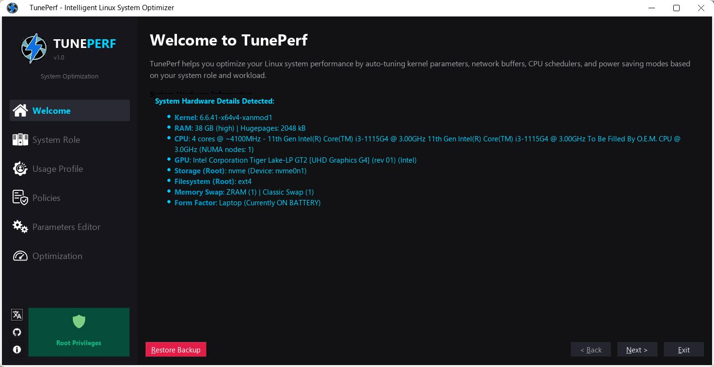
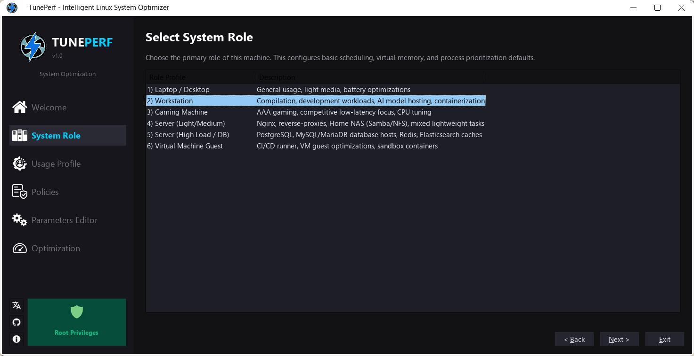
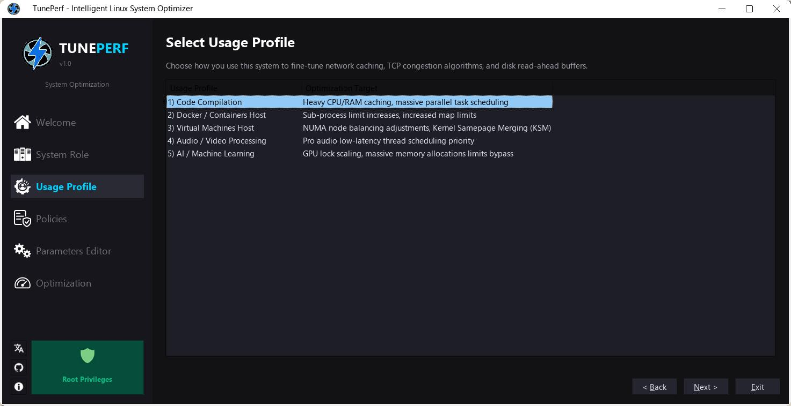
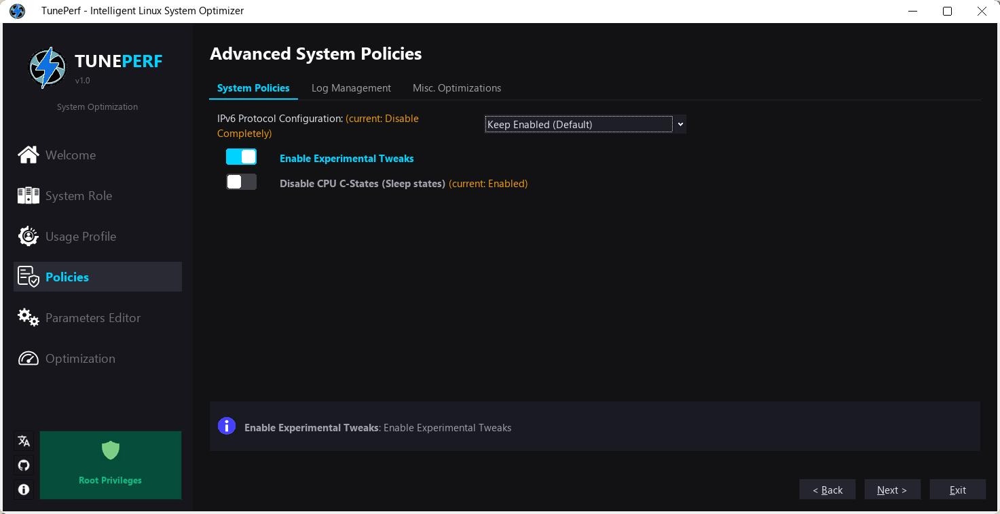
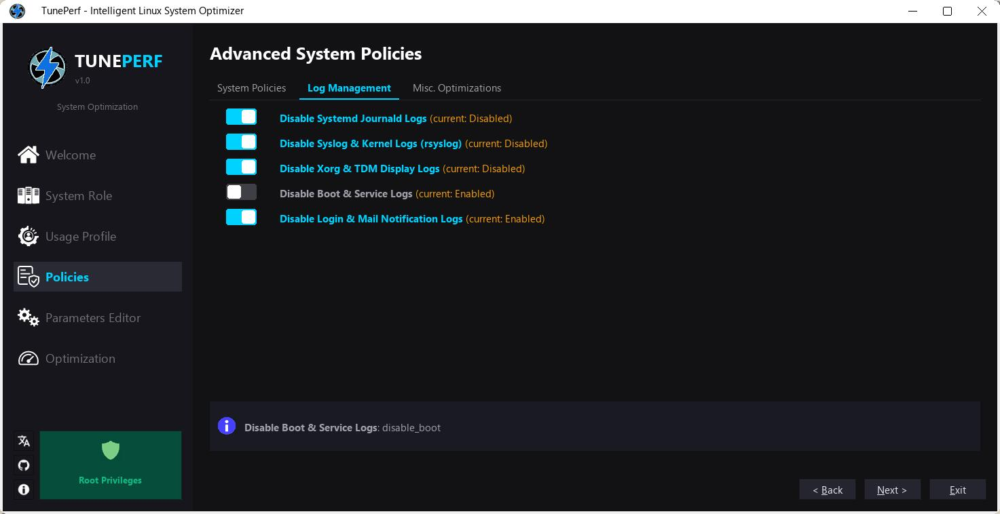
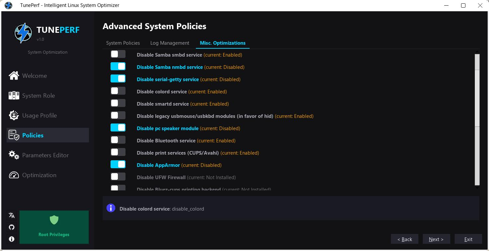
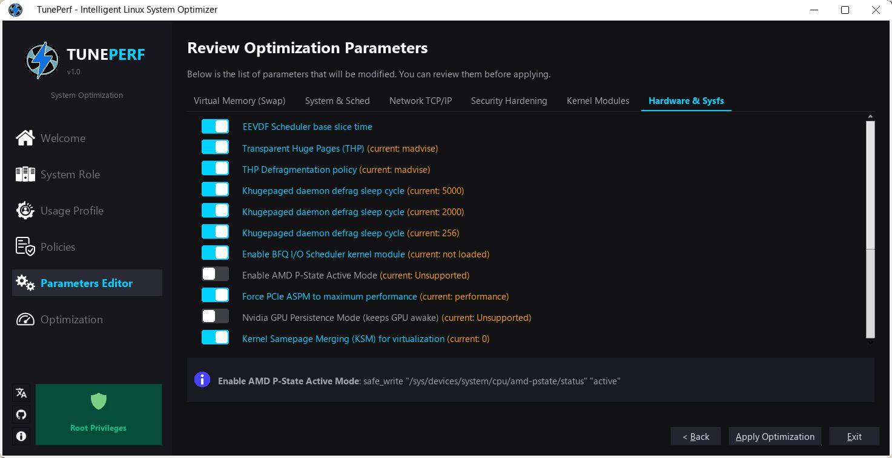
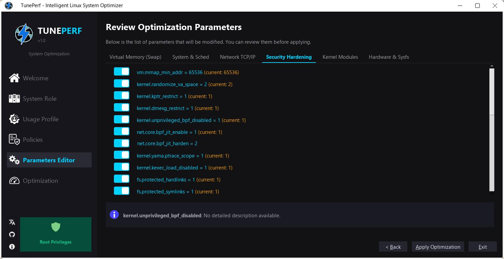
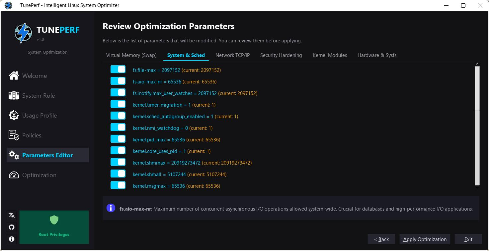
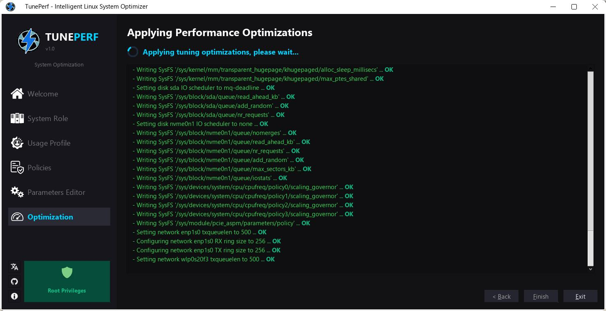

# TunePerf - Linux System Tuner


**TunePerf** is a system orchestration and performance tuning Bash script for Linux. 

Unlike the myriad of copy-pasted scripts found on GitHub (which blindly apply obsolete `sysctl` values) or heavy background daemons, **TunePerf** is designed with surgical precision and prudence: 
it scans the complete hardware topology of your machine to generate tailor-made kernel, hardware, and init-system parameters. It applies them in a "One-Shot" manner, leaving absolutely no resident process behind.

---

## Philosophy

1. **No Resident Daemon**: "Performance shouldn't cost performance" ^^
Tools like `tuned` or `tlp` add a background process (often Python-based) that continuously polls the system. TunePerf configures the hardware, the kernel, and the system limits at boot, and then gracefully exits.
2. **Context-Awareness**: The optimal parameters for a 2GB RAM VPS are radically different from those for a 128GB NUMA Database server. TunePerf scales everything (backlogs, dirty bytes, queue depths) dynamically based on actual hardware capacity.
3. **Safety-First**: No risky parameters are enabled by default. Every generated kernel key is dynamically checked against the host's kernel version (`sysctl -n`) before being applied.
4. **Absolute Reversibility**: Every execution of the script generates a fully timestamped backup of the previous system state. The `--restore` flag allows for an atomic rollback.


---

## Graphical User Interface (GUI)

TunePerf includes a comprehensive graphical desktop client (**tuneperfs-gui**) to configure policies, profiles, scheduler weights, and service overrides interactively.

### Key GUI Features
1. **Fully Autonomous**: The GUI embeds the backend `tuneperf.sh` script, custom icons (compressed via `zx0em`), and multi-language translations (German, French, Spanish, Italian, Polish, and English) inside a single, zero-dependency executable. The script and the GUI are fully independent; you only need to deploy what you intend to use.
2. **System Language Auto-Detection**: Automatically detects the system locale (e.g., `fr`, `de`, `es`, `it`, `pl`) at boot and loads the correct translation, falling back to English if the locale is not supported.
3. **No Root Startup Required**: Runs securely under your normal user session and presents a privilege dialog only when applying optimizations or interacting with the service backend.

### Two GUI Versions Available
* **TDE Dynamic Build**: Compiles dynamically against the **Trinity Desktop Environment (TDE)** libraries for native integration on Trinity/TDE desktops.
* **Standalone Static Build**: Links statically against **TQt3**, compiling into a single executable that runs on any Linux distribution (Debian, Ubuntu, Mint, Fedora, Arch, etc.) without requiring TDE or any manual library setup.

---

## The Often Neglected Details (That this script address)

Most tuning scripts stop at the superficial software layer. TunePerf goes all the way down to physical hardware abstraction and deep kernel internals:

### 1. True EEVDF Scheduler Support (DebugFS)
Since late 2023, Linux replaced its historical CFS scheduler with **EEVDF**. Tweaking obsolete sysctls like `kernel.sched_latency_ns` is an illusion. TunePerf detects if `/sys/kernel/debug/sched` is mounted and directly manipulates the internal `base_slice_ns` values (e.g., 1ms for gaming/latency, 8ms for server throughput), directly communicating with the kernel's debug abstraction.

### 2. SystemD Global Limits Bypass
Increasing `fs.file-max` via sysctl is useless on modern distributions if SystemD enforces its own limits on your applications. When the Experimental Tier is enabled, TunePerf manipulates `/etc/systemd/system.conf` and `user.conf` to shatter default slices, enforcing `DefaultLimitNOFILE=1048576` and `DefaultLimitMEMLOCK=67108864` (64MB) across the entire OS.

### 3. ZRAM & Memory Topology Awareness
If ZRAM (compressed RAM) is detected, reading pages in chunks destroys performance through useless CPU decompression. TunePerf strictly sets `vm.page-cluster=0` for ZRAM, `1` for pure NVMe/SSD, and `3` for mechanical HDDs. Moreover, it actively forces ZRAM to use the highly-efficient `zstd` algorithm and automatically scales the compression streams to match the exact number of CPU threads (`max_comp_streams`).

### 4. Hardware Bufferbloat Mitigation & Receive Packet Steering (RPS)
Optimizing TCP stacks is useless if the Network Interface drops packets. The script dynamically caps Ethtool Ring Buffers to `4096` to prevent latency explosion, and forces `pcie_aspm=performance` to reduce PCIe wake delays. It also disables `irqbalance` in experimental mode to prevent CPU Cache Thrashing, and actively maps Receive Packet Steering (`rps_cpus`) across all available hardware cores via hex-mask generation, eliminating single-core network bottlenecks.

### 5. Persistent BBR Congestion Control & Conntrack Scaling
A common mistake is injecting BBR via sysctl while the kernel module isn't loaded yet. TunePerf properly hooks `tcp_bbr` and `sch_fq` into `/etc/modules-load.d/tuneperf.conf` to guarantee availability. Furthermore, if the system relies on connection tracking (`nf_conntrack`), it automatically scales the tracking tables based on hardware RAM (avoiding "table full, dropping packet" errors).

### 6. Khugepaged & SysV IPC Tuning
Rather than leaving the Transparent Hugepage daemon unchecked, TunePerf aggressively disciplines `khugepaged` (`scan_sleep_millisecs`) to prevent micro-stuttering ("CPU stalls") during memory defragmentation. For databases like PostgreSQL, it dynamically maps 50% of available RAM directly to the SysV IPC shared memory limits (`shmmax`, `shmall`).

### 7. Per-Device Disk Iteration (NVMe vs SSD vs HDD)
The script physically inspects `/sys/block/*`, identifies the controller types, and applies modern I/O Schedulers accordingly (`none` for NVMe, `mq-deadline` for SSD, `bfq` for HDD) on a per-device basis.

---

## Usage

### Standard Execution (Interactive)
```bash
sudo ./tuneperf.sh
```
The script will prompt you to define the Machine Role (Desktop, Server, Gaming), the specific Usage, IPv6 policy, and whether you want to unlock the Experimental Tier.

### Silent Mode / Re-apply
```bash
sudo ./tuneperf.sh --apply
```
Applies the profile generated during the last interactive run. Perfect for Ansible or bash automation.

### Simulation Mode (Dry Run)
```bash
sudo ./tuneperf.sh --dry-run
```
Detects hardware and generates final configuration files inside `/etc/tuneperf/generated/` without applying them to the system, allowing you to safely audit the changes.

### Restoration Mode (Rollback)
```bash
sudo ./tuneperf.sh --restore
```
Removes all modifications, restores your old `sysctl.d` files, destroys the SystemD overrides, and cleanly disables TunePerf's persistence.

### Extreme Performance Mode
```bash
sudo ./tuneperf.sh --disable-mitigations
```
An independent, dangerous flag that modifies GRUB to inject `mitigations=off`. This disables all hardware Spectre/Meltdown protections to gain 15% to 30% of raw CPU power. Requires a reboot.

---

## Persistence

TunePerf does not leave a daemon running in the background. It generates:
1. **Standard Conf Files**: Placed in `/etc/sysctl.d/99-tuneperf-*.conf` (natively loaded by the kernel at boot) and `/etc/modules-load.d/`.
2. **A SystemD Oneshot Service**: `tuneperf-sysfs.service`, which executes hardware optimizations (Ethtool, EEVDF DebugFS, CPU Governors, I/O Schedulers) during the boot sequence, and then gracefully terminates.
3. **Dynamic Udev Rules**: For laptops, ACPI rules trigger a minimalist payload specifically when you plug or unplug the charger, instantly adjusting the CPU scaling governors without touching the rest of the stack.

---

## Compilation & Packaging

TunePerf includes simple scripts to compile and package the GUI client for release:

### Build binaries:
* `./build.sh` — Compiles the TDE dynamic version (**build/src/tuneperfs-gui**).
* `./build_static.sh` — Compiles the standalone static version (**build-static/src/tuneperfs-gui**).

### Create Debian packages:
* `./build_deb.sh` — Compiles and builds the dynamic package (**tuneperfs-gui_1.0_amd64.deb**).
* `./build_static_deb.sh` — Compiles and builds the standalone static package (**tuneperfs-gui-static_1.0_amd64.deb**).

### Create Archive Tarballs:
* `./build_tar.sh` — Packages the dynamic build as a compressed archive (**tuneperfs-gui_1.0_amd64_dynamic.tar.gz**).
* `./build_static_tar.sh` — Packages the standalone static build as a compressed archive (**tuneperfs-gui_1.0_amd64_static.tar.gz**).

---

## Screenshots

| Page 1: Welcome | Page 2: System Role | Page 3: Usage Profile | Page 4: Policies | Page 5: Parameters Editor |
| :---: | :---: | :---: | :---: | :---: |
| <a href="screenshots/screenshot_tuneperf_1.jpg"></a> | <a href="screenshots/screenshot_tuneperf_2.jpg"></a> | <a href="screenshots/screenshot_tuneperf_3.jpg"></a> | <a href="screenshots/screenshot_tuneperf_4.jpg"></a> | <a href="screenshots/screenshot_tuneperf_5.jpg"></a> |
| **Page 6: Optimization** | **Execution Log** | **Success Dialog** | **Language Menu** | **About Dialog** |
| <a href="screenshots/screenshot_tuneperf_6.jpg"></a> | <a href="screenshots/screenshot_tuneperf_7.jpg"></a> | <a href="screenshots/screenshot_tuneperf_8.jpg"></a> | <a href="screenshots/screenshot_tuneperf_9.jpg"></a> | <a href="screenshots/screenshot_tuneperf_10.jpg"></a> |
